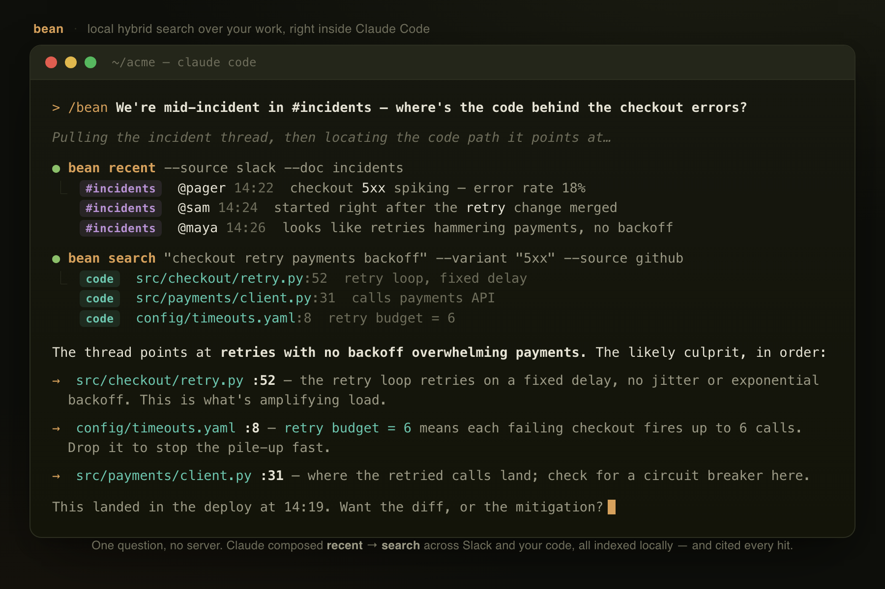

bean is a local search for your project, packaged as a Claude Code plugin.

# bean

bean gives Claude Code access to your issues, wiki, and chat so anyone using your project has unified
access to your project knowledge. Additionally, bean has no server: it pulls with your own
credentials, embeds on your machine, and stores everything locally. Embeddings can be stored
locally, committed to the repo via git (lfs), or shared over s3 — a committed `.bean/` folder
carries the team's sources and settings with the code, and every repo's commit history is
searchable out of the box.



## Install

In Claude Code, add this repo as a plugin marketplace, then install the plugin.

```bash
/plugin marketplace add https://github.com/henneberger/bean.git
/plugin install bean@bean
```

## Use it from Claude Code

```bash
/bean init                     # connect sources — a guided conversation
/bean sync                     # fetch changes and re-embed only what changed
/bean how do refunds work?     # ask; answers cite doc titles and URLs
/bean status                   # what's connected, indexed, and which embedding model
/bean sql "SELECT …"           # read-only SQL over the store (no query = print the schema)
```

`/bean` is not one search. Claude picks from a toolbox (hybrid `search`, `recent`, whole-`thread`
or `doc` pull, graph `related`, `neighbors`) and composes them. Ask *"I had a convo in the product
channel, what's the impact on my docs?"* and it grabs the recent Slack conversation and pulls the
topics out. Then it searches your Google Docs for what those topics touch.

## Try asking

`/bean` takes plain questions — Claude figures out which tools to run. Some things to try:

- **"what's new this week?"** Recent activity across every source, newest first.
- **"where did I write about WAL?"** Finds the doc even if you called it a "write-ahead log"
  elsewhere. Exact terms and identifiers land too.
- **"what did we decide about pricing in #product?"** Pulls the Slack thread and summarizes.
- **"who last touched the billing runbook, and when?"** Author and recency come back with the hit.
- **"find ticket ZQ-9001"** An identifier lands its chunk even with nothing semantically near it.
- **"what else relates to the launch doc?"** Graph hop to the same project/channel/author.
- **"summarize the deploy thread and link the doc it references."** Multi-step: thread, then search, then cite.
- **"what changed since Monday?"** Date-filtered recency (`--since`).

Under the hood these map to `search` (with `--variant`, `--author`, `--since`, `--before`), `recent`,
`thread` / `doc`, and `related`. Claude runs them for you and cites every source by title and URL.

## Connectors

bean ships **11 core connectors**, always on:

| Source | Auth | What it indexes |
|--------|------|-----------------|
| **Git history** | none | the current repo's commit messages — one document per commit, author + date attributed, searchable with `--author`/`--since`; on by default |
| **Slack** | user token (`xoxp-…`) | channels — one document per thread, one per standalone message |
| **Google Drive** | gcloud sign-in | Docs, PDFs (extracted), and comments (each comment its own author-attributed entry); whole Drive folders |
| **GitHub** | personal access token | issues and pull requests (body + comments) |
| **Confluence** | Cloud (email + API token) or Server/DC (PAT) | space pages (storage HTML → text) |
| **Jira** | Cloud (email + API token) or Server/DC (PAT) | project issues + comments |
| **Zendesk** | subdomain + email + API token | tickets + help-center articles |
| **Salesforce** | OAuth token + instance URL | Knowledge articles + Cases |
| **HubSpot** | private-app token | tickets, notes, and knowledge-base articles |
| **Microsoft 365** | device-code or `az` CLI | OneDrive/SharePoint files, Outlook threads, Teams messages (one doc each) |
| **Discord** | bot token | channels — one document per message |
| **Local files** | none | a folder (crawled recursively) or file — Markdown/text, office docs (**Word**, OpenDocument, RTF, **PowerPoint**, **Excel**), **HTML**, and **PDF** |

Where a service offers more than one way in, bean supports both. It prefers the path an individual
can set up without an admin: Atlassian Cloud tokens or Server PATs, Microsoft device-code or `az`.

### More connectors: drop-in plugins

**Need a source bean doesn't have?** Author a connector — a single offline-testable module dropped
into `~/.bean/plugins/`, live with no core edits. Copy [`docs/connector-template.py`](docs/connector-template.py)
(contract + helpers inline) to start; the core connectors in
[`bean/connectors/`](bean/connectors/) are worked examples across every API shape. `bean plugins list` shows what's loaded.

### Global vs local scope

A connector is **global** or **local**. Global connectors (your Slack, personal Google Drive, Gmail)
index once into a shared `~/.bean/_global/` store and are searchable from *every* repo. Local
connectors (a GitHub project, this repo's files) live in the per-repo workspace. Search unions both,
so from any repo you see that repo's local sources plus everything global. Credentials are always
shared per-user; scope only governs where the *tracked items + index* live.

```bash
bean scope                       # show each connector's scope
bean scope github local          # this repo only
bean scope slack global          # all repos
```

Tracked refs (repos, channels, folders) go into the source's config file lists — `bean init` prints
each source's config path and list names.

Changing scope moves the connector's config and purges its old index, so run `bean sync` afterward.

## Drop it into your repo: the `.bean/` folder

bean travels with the repo. A committed `.bean/config.json` (same shape as the personal config)
declares the team's sources and settings — anyone who clones the repo inherits them; each person
authenticates with their **own** credentials (which never enter the repo). Personal config overrides
the committed file; tracked-ref lists union.

```jsonc
// .bean/config.json — committed
{
  "github": {"repos": ["acme/app"]},
  "slack": {"channels": ["#eng"]},
  "settings": {"cloud": {"enabled": true, "backend": "git", "role": "consumer"}}
}
```

A clone that hasn't authed a declared source isn't an error — `bean sync` skips it with a nudge to
run `bean auth <source>`. Git history needs no auth at all, so every clone gets commit search for free.

### Where the embeddings live

| Backend | Set up with | Teammates get the index by | Notes |
|---------|-------------|---------------------------|-------|
| **local** (default) | nothing | syncing themselves | index stays in `~/.bean/<repo>-<hash>/` |
| **git (lfs)** | `bean cloud init --backend git` | `git clone` — zero steps | catalog committed at `.bean/catalog`; data files on git-lfs (`.bean/.gitattributes` written for you), manifests in plain git; commit `.bean/` after each sync |
| **s3** | `bean cloud init --bucket …` / `connect` | `bean cloud connect` + `bean pull` | needs the `aws` CLI and bucket access |

One rule for the shared backends: **one writer** (a maintainer or CI job runs `bean sync` and, for
git, commits `.bean/`) — Lance catalog versions don't merge across branches. Clones default to
read-only consumer; take over with `bean cloud role writer`. Deleted documents' vectors persist in
git history under the git backend — treat a committed index as append-only.

## Hybrid search

Every query runs two rankings and fuses them with **weighted** reciprocal rank fusion:

- **Vectors** (Lance) for meaning: *"how are customers billed"* finds the billing doc that never
  says "billed".
- **Keywords** (DuckDB) for exactness: an identifier like `ZQ-9001`, an error string, or a
  `#channel` lands its chunk even when nothing is semantically near it.

Fusion is tunable. Pass extra `--variant` queries (a paraphrase plus the identifiers you spotted)
and they all fuse. `auto_weight` leans keyword for identifier queries and vector for questions.
`recency_decay` biases toward recently changed docs. Adjacent chunks **merge into sections**. An
optional local cross-encoder **reranker** (`search.rerank.enabled`, fastembed, no API) polishes the
top results. Filter by `--author` / `--since` / `--before`, or widen from a doc to its graph
neighbourhood with `bean related <ref>` (same repo/project/channel/author). Turn fusion off
globally with `config set search.hybrid false`.

## Configuration

Settings resolve in four layers, later wins: built-in defaults ← global `~/.bean/config.json` ←
the repo's committed `.bean/config.json` `settings` block ← the personal workspace `settings`
block. Nothing is an environment variable; secrets never live here (tokens stay in
`~/.bean/credentials/`, mode 0600).

```bash
/bean config list                              # the full resolved config
/bean config get search.recency_decay          # one value
/bean config set embedding.plugin ~/my_embedder.py   # swap in your own embedding model (code plugin)
/bean config set search.rerank.enabled true
/bean sync --rebuild                            # re-fetch + re-embed to apply a model/chunk change
```

Every leaf below is settable with `config set <path> <value>` (values coerce to the default's type).
Changing an **index-shape** knob (embedding model, any `chunking.*`, enabling `rerank`) needs a
`bean sync --rebuild`. `status` warns if the index was built with a different embedding model than
configured.

| Path | Default | What it does |
|------|---------|--------------|
| `embedding.plugin` | `null` | `null` uses the one built-in embedder (`jinaai/jina-embeddings-v5-text-nano`); set it to a path/import path of a `.py` exposing `embed(texts)` (and optional `embed_query`) to use any other model — any library/API that returns vectors (⟳ sync --rebuild) |
| `embedding.batch_size` | `64` | embed batch size |
| `chunking.lines` / `overlap` | `40` / `8` | window height and shared lines (⟳) |
| `chunking.max_chars` / `min_chars` | `2000` / `40` | per-chunk cap; drop windows shorter than this (⟳) |
| `chunking.title_prefix` | `true` | embed the doc title into each chunk for recall (⟳) |
| `chunking.large_chunks` / `large_chunk_ratio` | `false` / `4` | coarse doc-level vectors for broad questions (⟳) |
| `search.hybrid` | `true` | fuse vector + keyword (false = vector only) |
| `search.k` | `8` | results returned |
| `search.rrf_k` / `keyword_pool` | `60` / `200` | RRF constant; keyword candidate pool |
| `search.expand` | `1` | neighbouring chunks pulled around each hit |
| `search.vector_weight` / `keyword_weight` | `1.0` / `1.0` | fusion weights per ranking |
| `search.auto_weight` | `true` | lean keyword for identifier queries, vector for questions |
| `search.recency_decay` / `recency_floor` | `0.0` / `0.75` | time-bias toward newer docs (0 = off) |
| `search.merge_sections` | `true` | coalesce adjacent same-doc chunks into one section |
| `search.rerank.enabled` / `model` / `pool` | `false` / `Xenova/ms-marco-MiniLM-L-6-v2` / `40` | local cross-encoder rerank, no API (⟳ to warm) |
| `graph.enabled` | `true` | build the `related` edge index during sync |
| `sync.stale_days` | `7` | warn (never auto-sync) when the index is older than this; 0 = off |
| `ocr.backend` / `model` / `dpi` | `auto` / `baidu/Unlimited-OCR` / `200` | PDF text backend (below) |
| `slack.lookback_days` | `14` | initial backfill: how far the **first** Slack sync reaches back; later syncs continue from the cursor |
| `discord.lookback_days` | `14` | initial backfill for Discord channels (first sync only) |
| `gdocs.lookback_days` | `30` | initial backfill for auto-indexed Drive files; later syncs discover only files changed since (cursor). 0 = all |

**Per-source chunking.** Any `chunking.*` leaf can be overridden per source as `<source>.chunking.*`
(e.g. `bean config set slack.chunking.lines 15` or `gdocs.chunking.max_chars 1500`). A source's
effective chunking is the global `chunking` block with its own `chunking` sub-block merged on top.
Slack ships smaller defaults (`slack.chunking` = lines 15, overlap 3, max_chars 1000, min_chars 20)
since chat is short; git commit messages get the same treatment (`git.chunking`, min_chars 10).

`lookback_days` is a one-time choice: `/bean init` prompts for it per source and it bounds only the
**first** sync's backfill. After that each source tracks a cursor and pulls just what's new, so you
never re-scan a window on every sync. `sync --rebuild` ignores the cursor to re-pull within `--since`.

**One built-in embedder, and a plugin hook for anything else.** bean embeds with
`jinaai/jina-embeddings-v5-text-nano`, run in-process via sentence-transformers — fully local, no
API. It's a task-aware retrieval model, so queries and documents are encoded with different prompts.
There's no backend/model switch and no silent fallback: if the model can't
load, bean fails loudly rather than degrading to something worse. To use a different model, point
`embedding.plugin` at a `.py` (a path or import path) exposing `embed(texts) -> list[list[float]]`
(and optionally `embed_query(text)`) — any library or API that returns vectors. It's a static config
value, never an environment variable. The built-in weights download automatically the first time you
sync or search (not at setup), and bean caches them after.

## PDF parsing

bean reads PDFs in local folders and PDF files stored in Google Drive. Both go through the same
extractor and honor the `ocr.backend` setting below. Born-digital PDFs use embedded text (pymupdf, a
base dependency). For scans, handwriting, or complex layouts, set `ocr.backend` to `unlimited-ocr` and
bean runs pages through [baidu/Unlimited-OCR](https://github.com/baidu/Unlimited-OCR), a
vision-language OCR model. You install nothing: bean provisions the OCR toolchain (torch,
transformers) into its own venv the first time OCR runs, the same way the embedding model downloads
itself. It runs on CUDA, Apple MPS, or CPU, whichever the machine has. The default `auto` backend
takes embedded text where it exists and OCRs only the pages that have none. OCR stays opt-in because
it's slow: Unlimited-OCR is high quality but ~40s/page on CPU.

## Indexing speed

Everything runs locally on CPU, so the first sync of a big backlog takes real time. Rough numbers on
a 2024 laptop (Apple M3 Pro, no GPU). The built-in embedder is a compact transformer
(`jinaai/jina-embeddings-v5-text-nano`), so every chunk is a full forward pass — but it's small and
fast on CPU, so text embedding flies; the slow path is scanned-PDF OCR (below):

| Work | Throughput | So a first sync of… |
|------|-----------|---------------------|
| **Text/office docs** (Slack, Docs, wikis, Markdown, `.docx`/`.pptx`/`.xlsx`, comments) | **~40 chunks/sec** (≈140k/hour) | 50,000 docs (~4 chunks each) ≈ **1.5 hours** |
| **Born-digital PDFs** (embedded text, pymupdf, the default) | **~350 pages/sec** | basically instant; a 300-page PDF ≈ 1 sec |
| **Scanned PDFs** (`ocr.backend = unlimited-ocr`, opt-in) | **~40 sec/page** (~1.5 pages/min) | 700 scanned pages ≈ **8 hours** |

**Scanned PDFs are the slow path.** With OCR on, plan on ~40 seconds per page and **leave the laptop
running overnight**. A few hundred pages is an evening. A few thousand is a couple of nights. Sync is
resumable, so an interrupted run picks up where it left off. (One-time downloads on first use,
excluded above: the built-in `jinaai/jina-embeddings-v5-text-nano` weights ~480 MB, and the OCR model ~6 GB the
first time you enable it.)
